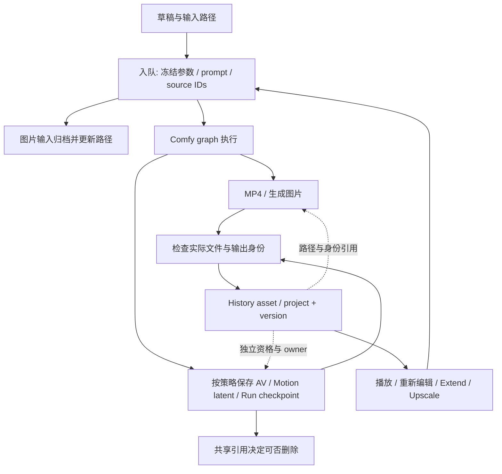
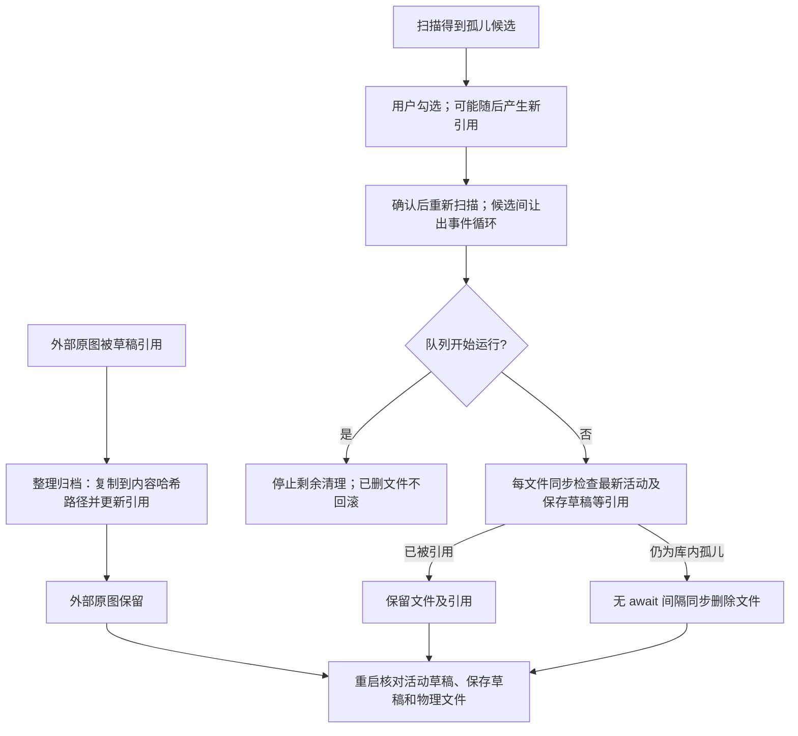
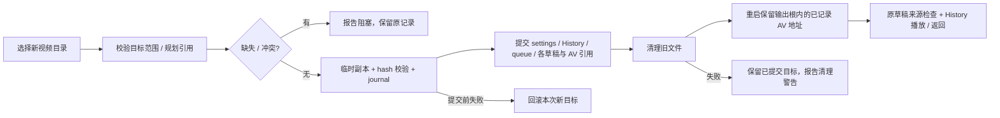
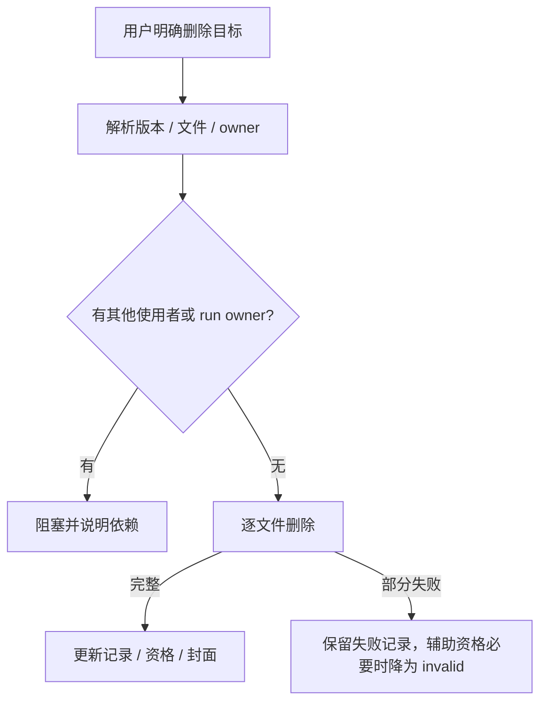
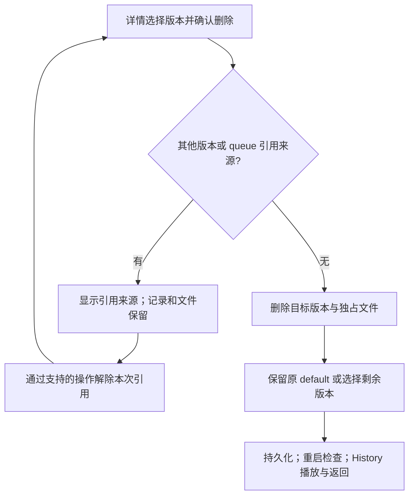

# 资产库：任务落盘、引用、检查、转移与删除

类型：运行手册；状态：current；更新：2026-09-28。这是当前实现的操作地图，不是新的持久化契约。业务改动仍遵循 [Architecture](../ARCHITECTURE_CONTRACT.md)、[Workflow](../WORKFLOW_CONTRACT.md) 和 [验证分级](../CHANGE_VERIFICATION.md)。

先运行 `harness:app -- guide assets`。只读本次动作涉及的表格和入口，不通读所有文件。已验收任务的实跑证据与修复记录保留在[归档TASK](../archive/2026-09-27-agent-journeys/TASK.md)。

## 1. History 记录、媒体、续写数据是三个对象



- task ID 是执行身份；视频 asset ID 是作品身份，version ID 是具体结果身份。新生成/Extend 可建立新 asset 并保留 sourceAssetId/sourceVersionId；Upscale 通常追加原 asset 的版本。图片使用 project/versions。
- 成功任务会移出活动 queue；History 保存生成参数、prompt、工作流路径、Comfy prompt/output 记录、文件描述和派生关系，不是把所有二进制塞入 state。
- 视频输入通常仍是文件路径引用，不能假设导入即得到独立备份。图片首尾帧、图片参考槽等有输入归档流程；视频参考槽不能被图片素材库处理。
- MP4 能播放不代表 AV 可续写；AV available 也不能代替媒体解码。Motion Context 可以没有 latent，改走视频上下文。
- 一个物理文件可有多个角色：实跑 R2V Extend 的 canonical payload 同时是 JointAV payload、AV owner、Motion Context 路径。不要按字段数量统计磁盘用量或重复删除。
- 只有检测到实际输出的文件才可作为成功证据；workflow 预先拼好的路径不是已保存的文件。

## 2. 存在哪里

路径由 settings、选中的 Comfy core/data 和 resolver 决定，不能把开发机路径写进代码。下表用 U=userData，O=解析后的共享 Comfy output root，L=图片输入素材库。

| 内容 | 当前路径/来源 | 影响与修改入口 |
| --- | --- | --- |
| 草稿、queue、History、settings | U/studio-state.json | 身份与引用数据库；`electron/services/studio-paths.ts`、state repository |
| 视频成片 | settings.outputDirectory；实际文件看 HistoryFile.absolutePath | `comfy-output-service.ts`、`core/comfy-output-paths.ts`；输出根和视频子目录不是同一概念 |
| 图片生成结果 | settings.imageOutputDirectory / 环境解析 | 图片 project 的 generated version；不能当输入孤儿文件清理 |
| 图片输入/绘制参考图 | L/sources/&lt;sha256&gt;.&lt;ext&gt; | L 优先 settings.imageInputLibraryDirectory；默认由 O 的父目录推导 input/LocalVideoStudio，见 SettingsService resolver |
| H3 Native AV | O/h3-native-av/ 中 payload + manifest | `h3ContinuationData.artifact`、`h3AvAsset.ownerPath/aliasPaths`；可被 canonical 化和复用 |
| Motion Context latent | O/h3-motion-context/&lt;taskId&gt;/clip_00001.safetensors；兼容 h3_context | 传统格式与 Native AV 不同；新 canonical 路线也可能引用上行同一个 payload，必须看 schema/角色 |
| Continuum managed | O/h3-continuum/runs/...，及 h3-continuum-assets 的登记 manifest | official run/chunk owner、receipt/序列指针；不能从一个 History 版本推断整个 run 都属于它 |
| 封面 | U/history-covers/v3 | 可重建缓存，删除/刷新由服务管理，不能代表原视频 |
| 绘制与临时输入 | U/image-guides、image-masks、image-crops、clipboard-inputs/files；任务 temp/checkpoint | 各自生命周期；不能用“临时目录”标签推断可无条件删除 |
| 迁移 journal | U/video-history-migration.json | 保存迁移事务阶段，不是资产本体或完整备份 |

同级视频/图片目录可以共同推导 O；环境 fallback 也可能使用选中 Comfy data 的 output。具体规则在 `electron/services/environment.ts` 的 sharedComfyOutputRoot/resolveComfyOutputDirectory。查文件先走应用 resolver，不能机械拼接“设置目录 + filename”。

复合任务可能暂存中间 MP4、payload、manifest、分段或 checkpoint。某些成功路径会清理中间件，失败/重启保留以供恢复；例如 H3 native 1080p 最终成功只交付 final 输出。不能假设“一次任务只有一个文件”，也不能把整个输出目录全部视为这个任务的所有物。

Continuum bootstrap 的 `extend-segment-clean-av` 描述续写片段，最终 MP4 则可能已拼接源视频。实跑样例的 AV manifest 为 141 帧、contextFrames=22，成片为 159 帧；History 时长必须与成片解码核对，不能直接使用 AV 帧数或请求的续写秒数。配对资格 available 与下一轮实际复用成功也属于不同证据层。

新 Create/Extend 成片在 `QueueExecutionSideEffects.completeVideoTask` 入库前通过 `video-output-duration.ts` 探测视频轨，传入 `queue-history.ts` 的 actualDuration；这是完成结果，不回写任务请求。探测失败记录告警并沿用估算；旧历史不自动回填。Continue 源视频的 loadedmetadata 还会校正草稿时长/裁剪，不能用这个纠正来证明 History 入库准确，两层分别验收。

### Managed Run 的来源与文件边界

managed 续写要求已有已接受前缀，不能把可播放 MP4、bootstrap canonical AV 或空 sequence 当作 run。资格从 `history-artifact-service.ts` 开始：acceptedChunks、原始 firstFrameSource、receipt/run storage 与当前 head 必须符合检查；这是 source gate，启动 ComfyUI 不能补齐缺失前缀。

| 对象 | 定位 / 责任 |
| --- | --- |
| sequence / receipt | History 版本与草稿/任务快照中的身份、accepted chunks、canonical head、已接受提示词、原始 firstFrameSource；保留父作品/版本 |
| Run 文件 | O/h3_continuum/runs/ 下的 project.json、revision manifest 与 chunk payload；按 receipt/run owner 的实际路径定位，不能用当前视频末帧替换原始来源 |
| owner / alias | continuum-run-chunk 的 owner 指向 run payload；h3-native-av 可保存兼容 alias。删除 alias 不等于删除 owner；单版本 AV 删除会拒绝直接删除 run chunk |
| registry sidecar | O/h3-continuum-assets/&lt;assetId&gt;.json，由 h3-continuum-asset-registry.ts 管理；与 run、History 引用共同核对，不是独立媒体副本 |

只复制 studio-state.json 或MP4/AV pair不足以建立managed fixture。默认复制全部被引用的run、receipt、owner/alias、registry与原始来源，保持身份/相对关系并检验resolver/head。用户明确授权实库测试时，先备份状态和所选Run/registry，保留原文件并核对测试后的head；未授权时不修改真实用户run。不要把未引用的整个目录算作该作品所有。

2026-10-04 的负探针是无前缀拒绝→Motion Context恢复，旧19份隔离状态不含合格来源。2026-10-08用户授权实库后，当前环境真实managed首段API夹具→History实际1→2、8秒播放/重启及owner/alias/registry核对通过；不证明普通用户首次managed入口。公共Run使用h3_continuum/runs，库存同时兼容旧h3-continuum/runs。复用段重新封装产生的新payload/registry也须审计，不能只跟随原逻辑chunk的assetId。新增保护后真实2→3生成12秒成片；旧Run采样契约不兼容在官方Run锁内、写manifest前拒绝，旧head/文件/registry/History不变，无手动恢复。该前置保护不等于所有后续错误或崩溃的事务回滚。

## 3. “检查”“整理”“转移”分别做什么

| 用户动作 / API | 实际行为 | 不代表什么 |
| --- | --- | --- |
| 检查图片素材库 / scanImageAssetLibrary | 汇总草稿、queue、图片项目及视频 History 的**图片输入引用**；报告已管理、待归档、缺失、库内孤儿及字节数 | 不是全盘媒体扫描，不检查 MP4/所有 AV，不自动修复或删除 |
| 整理归档 / organizeImageAssetLibrary | 复制被引用图片到 content-hash 目标，校验副本，更新 state 引用；去重相同内容、整理旧层级 | 不自动删除外部原图；旧副本要重新检查后才能清理 |
| 清理选中的孤儿 / cleanupImageAssetLibrary(paths) | 重新扫描，只有仍是孤儿且位于 L 内的请求路径才能删除；清理空 sources 目录 | 不能传任意路径当文件删除 API；检查后出现新引用的文件不能再删 |
| 改视频目录，仅应用 / saveSettings(settings, "apply") | 改后续输出设置 | 不搬走旧 History 文件；旧记录的真实路径仍重要 |
| 应用并转移历史 / saveSettings(settings, "migrate-video-history") | 按受支持的 History/queue 引用规划文件，复制并校验，提交设置/引用，最后清理旧文件 | 不是搬走整个资产库、userData、模型、图片项目或所有 Continuum run |

“已管理引用”与“待归档”不是互斥计数。已经位于 L 内、但不符合 `sources/<sha256>.<ext>` 命名的被引用图片，会同时计入两者：它受到引用保护，整理归档仍可将其规范化。不能把“待归档”当作孤儿，也不能以文件位于库内就推断无需整理。



**真实图片库探针（5G-1）**：用 `launch-create-smoke.mjs <settings-source-state>` 创建空副本，等待 CDP 就绪后运行：

```powershell
node scripts/harness/image-library-smoke.mjs <fixture-dir> --port <port> --output <fixture-dir>/image-library.json
# 正常关闭自有窗口并等待 PID 退出，再恢复同一个副本
node scripts/harness/launch-create-smoke.mjs --resume <fixture-dir>
node scripts/harness/image-library-smoke.mjs <fixture-dir> --audit image-library.json --port <new-port> --output <fixture-dir>/after-restart.json
```

脚本只创建隔离 PNG/草稿，经实际 Settings→素材库→整理归档→两次清理确认，核对外部原图保留、草稿指向归档副本；保留 UI 的旧孤儿勾选后，用 AppApi 添加新草稿引用，再实际确认清理，只有真正孤儿消失。重启 `--audit` 为只读模式，核对活动/保存草稿、文件、扫描结果，保留新引用文件仍需规范归档的计数。`#image-assets-cleanup` 二次点击确认，不是全局确认按钮；无设置改动时 `#save-settings` 禁用，应跳过保存。输入与新增引用由 AppApi 准备，未验证原生文件选择器。

首次创建 baseline 后不重复操作同一副本；完整重跑应新建物理副本，保留失败报告。无需 GPU，结束后关闭自有窗口。

**5G-2 并发探针**：上述命令追加 `--during-cleanup`，在真实确认后的 scanning 进度中通过 AppApi 保存新引用，验证保存先于 cleaning，文件受到保护且真正孤儿被删除。之后 reload 同步 renderer，再实际切换视频/图片模式，核对非活动保存草稿保护及恢复；重启仍用 `--audit <成功报告>`。此选项不能与 audit 同用，扫描窗口来自隔离目录中的空目录，不是生产测试钩子。

扫描、归档、清理均包括活动 draft 与 imageToVideoDraft/videoExtensionDraft。清理逐文件读取当前已提交状态，检查与同步 unlink 之间没有异步间隙；目录解析/文件间新增引用和队列中途启动另有确定性回归。真实测试覆盖普通平坦与 canonical 路径，旧哈希分层整理为单测证据；应用内引用保护不等于外部进程文件锁，符号链接、异常权限及所有布局未穷举。



目录变更还要满足 SettingsService 的 Comfy output 范围限制。哈希在这里用于去重和验证复制完整性，有明确作用；验收仍要确认旧/新引用、播放、续写、失败回滚，不能只比较哈希宣布“资产可用”。

**已修复并实跑的范围（2026-09-29，Phase 5C）**：迁移提交时，`remapVideoMigrationConsumers` 按已规划的源文件精确映射 History、queue、活动/非活动草稿中的路径及嵌套 AV owner/alias；不改 prompt、身份或无关路径。`src/core/native-av-artifact-paths.ts` 供 History 重启恢复与 AV inspection 共用：优先保留输出根内、文件名与 AV 子目录相符的已记录地址，否则沿用标准目录恢复。检查返回实际读取的 manifest/payload 路径。首次补丁只回写 state 仍会被重启覆盖，回归须覆盖这两层。

新的 canonical AV 隔离实例经实际 Settings 迁移 3 文件后重启，18 处已登记引用均存在；原 Extend 草稿播放器 readyState=4，`window.studio.inspectVideoExtensionSource((await window.studio.getState()).draft)` 为 bootstrap/available，History 播放/返回通过。Phase 5B 的 14→16 处失效记录保留为修复前证据。真实 aliases、managed sequence/run、独立 registry、其他目录布局及删除仍需单独验证；本次不批量修复既有损坏记录。内部 registry 的 inventoryOutputRoot 也不等于同名用户按钮。

## 4. 用户能删除什么

下列文件删除最终走 unlink/rm，不能承诺进入回收站。先区分删除整个作品、单版本和辅助续写数据。

| 操作 | 文件/记录结果 | 保护与后续行为 |
| --- | --- | --- |
| 删除视频作品（含批量） | 删除其版本的视频与可管理辅助文件，再移除记录和封面 | 其他 History、草稿、queue 的共享路径/asset 引用可能阻塞；不是只删列表卡片 |
| 删除视频某版本 | 删除该版本文件，保留作品并选剩余版本 | 不能用此操作删除唯一版本；该情况走整个作品删除 |
| 删除 JointAV | 删除可管理的 payload/manifest/owner/aliases；该版本资格转 missing | MP4 保留；依赖 AV 的操作不再可用。continuum-run-chunk owner 禁止从单版本删除 |
| 删除 Motion Context 数据 | 删除可定位传统 latent，清除相应文件引用和路径 | MP4 保留；共享引用会阻塞。canonical AV 重合时须看实际 owner/格式，不能简单按扩展名选这个操作 |
| 删除图片生成版本 | 删除生成输出及对应版本/封面，保留项目 | source 原始导入版本不能单独删除；同项目共享输出要处理引用 |
| 删除整个图片项目 | 移除项目并清理非 source 生成文件 | 不顺带删外部原图/托管输入；留存素材由素材库扫描判断是否孤儿 |
| 清理图片孤儿 | 仅重新验证后的 L 内指定孤儿文件 | 不影响仍被引用的输入，不清理视频/AV |
| 清理应用缓存 | 由 cache-service 定义的缓存集合 | 与删除 History、素材库和输出目录是不同操作 |



文件系统删除并不是整体原子事务；部分失败不能谎称全部成功。删除保护依赖**最新引用状态**，不是只看最初点击时的截图。批量也必须检查逐项结果与剩余记录，不能把“请求已返回”当成全批成功。

**已实跑：canonical AV 辅助删除（2026-10-03，Phase 5D）**。History 的“删除原生 AV 数据”→确认，在活动/非活动 Extend 草稿引用时明确拒绝，文件与资格保留；通过 Create“清空草稿”解除引用后再次确认，删除 manifest/payload，保留 MP4、task/asset/version 身份。重启后 AV 为 missing，owner/嵌套 owner/Motion 引用已清除，旧来源检查为 bootstrap/missing，History 播放/返回通过。此结论不覆盖单版本/整作品删除、queue 共享引用或 managed run owner。

确认错误读取 `#app-flash.visible[data-kind=error] [data-flash-message]`，不是 `.toast`。新的删除脚本使用无遮挡按钮的真实鼠标事件，等待详情媒体可读；不能把观察器未捕获提示当作业务未执行。

```powershell
# 从既有 smoke 复制全新物理副本；使用启动器返回的目录/端口
node scripts/harness/launch-create-smoke.mjs --asset-source-state <prior-smoke-dir>/user-data/studio-state.json
node scripts/harness/asset-delete-smoke.mjs <fixture-dir> --delete --port <port> --output <fixture-dir>/deletion.json
# 正常关闭空队列窗口，等待进程退出，再恢复相同状态
node scripts/harness/launch-create-smoke.mjs --resume <fixture-dir>
node scripts/harness/asset-delete-smoke.mjs <fixture-dir> --port <new-port> --output <fixture-dir>/after-restart.json
```

删除脚本只接受单作品/单版本/canonical AV/无 aliases 的隔离副本；第一次保存 delete-baseline.json 后拒绝重复 --delete，保留失败证据，完整重跑须复制新 fixture。重启默认只读审计，不再次删除；播放和返回另运行 verify-video-smoke.mjs。目录迁移脚本要求文件都存在，不能用它审计 AV 已有意删除的状态。

**已实跑：整作品删除的共享草稿场景（2026-10-03，Phase 5E-1）**。在同样的新隔离副本上加 `--delete --whole-asset`：真实“删除视频和记录”先因活动/非活动 Extend 草稿引用而阻塞，清空草稿后再确认，MP4、AV pair 与 History 记录一起移除，自动回到空历史列表；重启默认审计按 baseline.kind=asset 确认没有恢复。整作品已不存在，不再运行该 task 的播放脚本。原 AV-only 模式仍保留视频；旧 baseline 无 kind 时按 AV-only 审计。此场景未覆盖多版本、queue 共享引用、批量和 managed owner；已完成 queue 记录不会因作品删除自动移除，不能误把空队列 fixture 的结果推广到它们。

### 多版本删除与 queue 保护

**已实跑（2026-10-04，Phase 5E-2）**：新增 `version-delete-smoke.mjs`，两种夹具均从单作品/canonical AV 来源复制所有物理文件，清空草稿并保持队列停止。新增版本是复制原视频构造的合成 Upscale 记录，不是实际超分输出；等待任务由生产 `upscaleTaskFromRequest` 构造，不代表已经验证 Upscale UI 入队。

- 独立 MP4：两个版本，默认选派生版本；实际切换版本→删除被等待任务引用阻止→在 Queue 真实移除任务→再次删除成功。仅目标 MP4/版本移除，原视频、AV 与作品身份保留，默认和当前播放回到剩余原始版本。重启后记录不恢复，原视频实际播放/返回通过。
- 共用 MP4：两个版本引用同一文件；删除被另一个 History 版本引用阻止，文件、两个记录及默认版本均保留，重启仍一致。服务即使先过滤待删除文件，仍对完整引用路径调用共享保护；不能据过滤逻辑推断“仅删除记录”。



```powershell
# 独立文件 + 等待引用；另一次用 --shared-version-source-state 创建共用文件场景
node scripts/harness/launch-create-smoke.mjs --version-source-state <prior-smoke-dir>/user-data/studio-state.json
node scripts/harness/version-delete-smoke.mjs <fixture-dir> --exercise --port <port> --output <fixture-dir>/deletion.json
# 正常关闭自有窗口并等待 PID 退出，再恢复
node scripts/harness/launch-create-smoke.mjs --resume <fixture-dir>
node scripts/harness/version-delete-smoke.mjs <fixture-dir> --port <new-port> --output <fixture-dir>/after-restart.json
```

首次保存 `version-delete-baseline.json` 后拒绝重复 --exercise；失败保留，完整重跑用新副本。脚本通过真实鼠标点击稳定、可见、启用的控件，核对精确 queue/history 引用提示。重启审计检查媒体可读；解码帧推进/返回另用 `verify-video-smoke.mjs`。仅剩一个版本时无版本删除按钮，整作品删除是另一入口。此次只有两个版本、停止队列中的 waiting 引用；超过两个版本的排序、运行中任务、批量/部分失败、managed run/aliases/registry 及多版本整作品删除不在此证据内。

## 5. Agent 的最小入口与验收

| 改动问题 | 先读这些入口 | 有意义的验证 |
| --- | --- | --- |
| 一次任务保存了什么 | `electron/queue-history.ts`、`queue-execution-side-effects.ts`、`services/comfy-output-service.ts` | 精确 task/version → 每个物理文件存在 → 媒体解码 → AV schema/资格；按角色去重 |
| 检查/归档图片 | `services/image-asset-library-service.ts`、`src/infrastructure/image-asset-library.ts` | 缺失输入→补齐；重复引用归档后仍可编辑；扫描后新增引用不能被当孤儿删除 |
| 视频目录转移 | `services/settings-service.ts`、`src/infrastructure/video-history-migration.ts`、renderer `shell/coordinator.ts` | apply 与 migrate 区别；冲突不覆盖；提交后旧文件清理；重启/播放/Extend/queued source 仍可达 |
| History 删除 | `services/history-destructive-service.ts`、`core/history-delete.ts`、History actions-controller | 共享引用拦截→解除本次引用→删除成功；单版本/全作品/辅助删除差异；部分失败资格正确 |
| AV 所有权 | `services/h3-continuum-asset-registry.ts`、`core/h3-av-asset.ts` | owner/alias/sequence 身份，不依据 .safetensors 后缀猜格式；run 级操作单独验收 |

```powershell
npm.cmd run harness:app -- guide assets
node scripts/harness/inspect-task-assets.mjs --port <port> --task <video-task-id> --output <report.json>
```

inspect-task-assets 通过真实 AppApi 按视频 task/version 读取已登记媒体/AV/latent 路径，再核对文件存在和非空；缺失返回非零。它是**只读物理文件证据**，不验证所有 schema、不扫描整个磁盘，也不执行删除/迁移。图片库检查可在 CDP 中调用 `window.studio.scanImageAssetLibrary()`。

迁移/删除验收使用明确复制到测试目录的 fixture；媒体路径、source 引用、AV owner 和 aliases 都必须核对归属，不能只隔离 state 却仍删到真实用户文件。当前完整覆盖状态见 TASK；本图不表示每条破坏性操作都已实跑。

复现 canonical AV 的目录迁移（不执行 GPU）：

```powershell
node scripts/harness/launch-create-smoke.mjs --asset-source-state <prior-smoke-dir>/user-data/studio-state.json
node scripts/harness/asset-migration-smoke.mjs <new-fixture-dir> --migrate --port <port> --output <new-fixture-dir>/migration.json
# 正常关闭空闲窗口，再重启；下面只读审计，不重复迁移
node scripts/harness/launch-create-smoke.mjs --resume <new-fixture-dir>
node scripts/harness/asset-migration-smoke.mjs <new-fixture-dir> --port <new-port> --output <new-fixture-dir>/after-restart.json
```

asset-source-state 仅接收既有 smoke 的单视频/canonical AV、空停止队列；复制媒体及所有草稿/owner/alias 文件引用，拒绝外部资产和 managed run owner。迁移夹具明确采用“视频目录为输出根、图片目录为根下 images”的布局，未覆盖所有子目录组合。--migrate 经真实 Settings 的“应用与路径→保存→应用并迁移”按钮；之后审计 History、各草稿及 queue 的物理引用，缺失返回非零。重启后先检查原草稿，不要先点击 History Continue 重新建立草稿而掩盖残留引用。History 播放可另用 verify-video-smoke；失败报告仍要保留。
