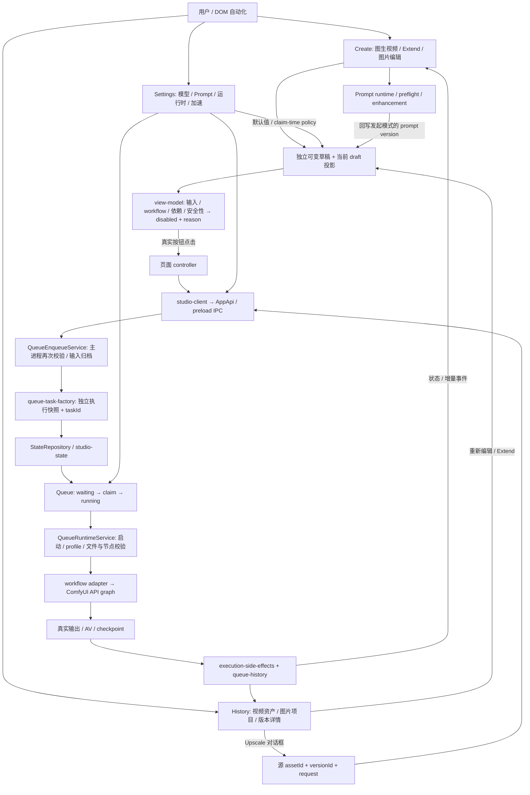
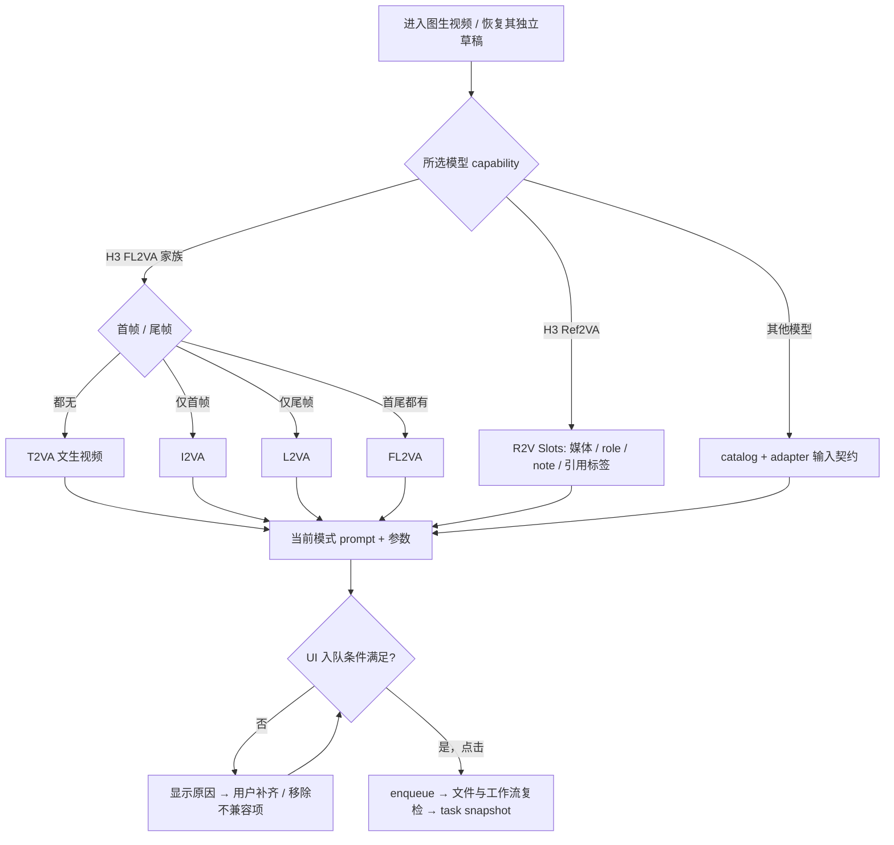
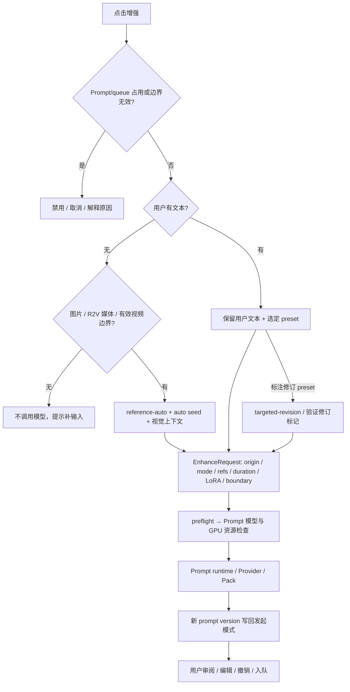
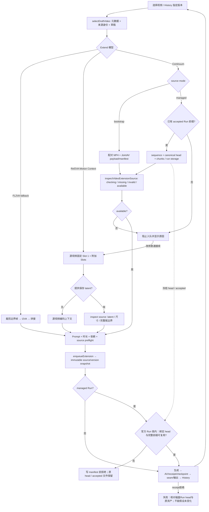
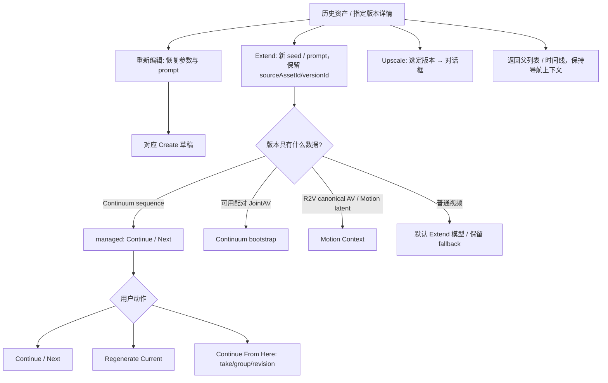
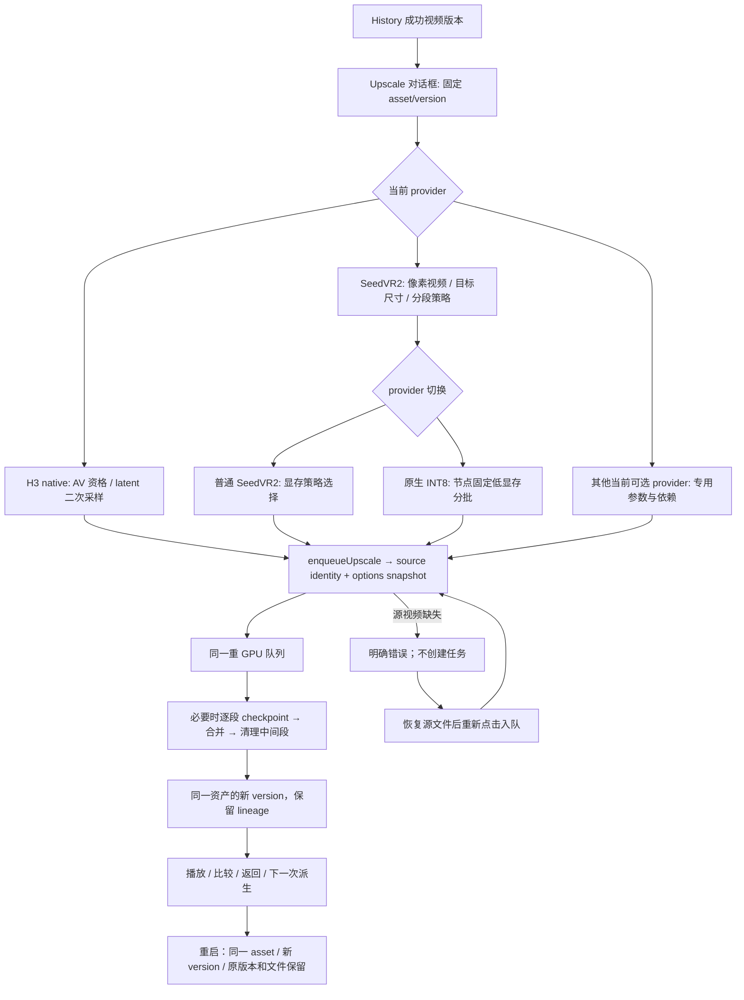
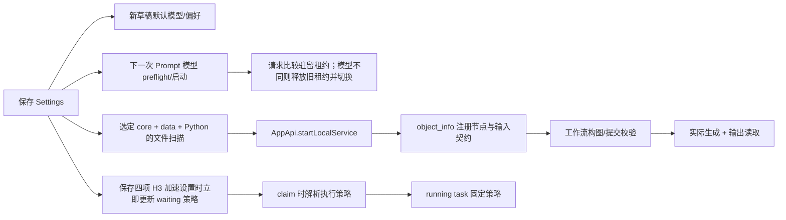

# 从用户操作到实现与验收

类型：架构与操作导航；状态：current；核对日期：2026-09-27。
范围：当前生产 renderer、AppApi、队列与模型路线。产品承诺仍由 [Architecture](../ARCHITECTURE_CONTRACT.md)、[UX](../UX_CONTRACT.md)、[Workflow](../WORKFLOW_CONTRACT.md) 定义；本页解释连接关系，不复制模型版本/文件清单。

先读总图，然后只读本次场景。用 `npm.cmd run harness:app -- list` 列场景，`npm.cmd run harness:app -- guide extend` 获取编辑入口、focused 命令和验收项。路由数据在 [journeys.mjs](../../scripts/harness/journeys.mjs)，路径存在性由测试检查。旧归档不再是理解 Extend 的首站。

## 总图：哪些层回答哪些问题

| 边界 | 负责什么 | 最小代码入口 |
| --- | --- | --- |
| 页面与刷新 | 路由、焦点、输入、播放；状态事件不能无故重建活动控件 | `src/renderer/entry.ts`、`render-coordinator.ts`、`pages/*/coordinator.ts` |
| 草稿 | `imageToVideoDraft`、`videoExtensionDraft`、`imageDraft`；`draft` 仅活动投影 | `src/core/creation-drafts.ts`、`video-draft-normalization.ts`、Create coordinator |
| 能力边界 | 页面用 capability，不读 preload global；Agent 可在真实 renderer 用 `window.studio` | `src/types.ts#AppApi`（符号）、`electron/preload.cts`、`src/renderer/studio-client.ts` |
| 提交 | UI 可提交只是第一关；主进程还验文件/graph/来源，随后复制快照 | `electron/queue-enqueue.ts`、`src/core/queue-task-factory.ts` |
| 执行 | 资源互斥、claim 时策略、取消/重启、输出收集 | `electron/queue-executor.ts`、`queue-worker.ts`、`services/queue-runtime-service.ts` |
| 持久化 | task / asset / version / run / AV 的身份与路径；重启迁移 | `electron/store.ts`、`queue-history.ts`、`services/queue-execution-side-effects.ts` |
| 模型事实 | capability、输入模式、文件、节点和 adapter | `src/core/catalog/`；禁止另写一份版本/权重清单 |

成功通常会将任务移出活动 queue；用 `version.taskId`（旧视频 original 可由 asset.taskId 回溯）查 History。不要等一个永远不会留在 queue 的 completed 项，也不要拿 `history.at(-1)` 当结果。

## 图生视频：选的是模型族，实际模式还由输入决定

- `h3PromptModeForDraft` 决定提示词模式；`h3WorkflowPathForInput` 决定执行工作流。两个都要核对。FL2VA 清空所有图可退到 T2VA；**R2V 空槽仍是 R2V 缺输入**，不能借此绕开校验。
- R2V 使用 Slots，而非首尾帧面板；图/视频、role、note、标签必须进入 prompt 请求及任务副本。增删/替换参考图也要测，不只测选模型。
- UI 阻塞由 `buildVideoCreatePageViewModel` / `videoEnqueueBlockReason` 投影到 `#enqueue.disabled`、`data-enqueue-block-reason` 和反馈文字；输入时 coordinator 的 `syncVideoEnqueueUi` 也要更新。单测某个 validator 不证明按钮会恢复。
- 模型切换是异步的（获取 bundled workflow）；要测快速切换和返回另一 Create 模式，避免旧返回值覆盖新草稿。

| 用户选项 | 影响链 | 最小反例 |
| --- | --- | --- |
| 保存 AV | UI 新提交为 all/none；`h3-latent-save.ts` 保留旧 joint-av/motion-context 兼容；影响未来原生 Extend/Upscale 资格 | 关闭保存仍能普通生成；History 不得声称原生 AV 可用 |
| Spectrum | `video-policy` + 安装/运行节点 + snapshot → graph patch；不是全局开关 | 已选但节点缺失时给出原因；补齐后可入队；Motion Context 禁用 |
| LoRA / Turbo | 所选模型/输入模式/组合 → 步数和 sampler 契约 → 文件及 graph 校验 | 切模型遗留不兼容 LoRA；仅把步数改成 4 不等于 Turbo |
| 分辨率 / 时长 / ratio | native spatial/frame budget → UI 和 queue safety → adapter geometry | 极限值和切模型后归一化；不能只测试默认 5 秒 |
| FPS / 插帧 | 模型原生 FPS 与交付 FPS 分离；H3 有自身归一化策略 | UI 显示与最终 frame count 不一致 |
| H3 Create 1080p | 符合资格的 FL2VA Base + JointAV → 720p first pass → learned latent second sampling | 不是直接 1080p 采样，也不是 History Upscale；只最终结果进 History |

修改入口：Create `view-model.ts` / `page.ts` / `page-controller.ts` / `coordinator.ts` → `video-policy.ts` / `workflow.ts` → `queue-enqueue.ts` / `queue-task-factory.ts`。新增模型从 catalog capability 起步，别在多个页面复制模型 ID 分支。

## 提示词：上下文决定请求，运行时决定能否执行

- “有图片没文字”和“有用户指令”要分别抓取实际请求；前者 `promptStrategy=reference-auto`，后者不会静默替换成自动随机创意。请求正确不能证明生成文本忠实，真实样例另做语义检查。
- H3 模式按实际输入求得；普通 FL2VA/boundary/Continuum Extend 均是 I2VA 边界条件，不能因 UI 没首帧槽当作 T2VA；Motion Context 是 R2V。
- Extend 的 `extensionSource` 含视频与裁剪边界，服务负责提取视觉上下文。Continuum 不伪造 R2V reference 标签，还带 previous chunk 信息。
- Prompt 模型选择与生成模型选择独立。当前 `promptModelId` 选择本地后端，`promptRuntimeForSettings` 固定为 ComfyUI；旧 LM Studio/runtime 字段不参与路由，不是独立 provider 选择器。27B 的显存确认/CPU 单次回退按现有契约，不在 harness 自动确认。
- 异步回写使用请求的 `origin`；切换到图片编辑或 Extend 后，旧请求只能更新原草稿。失败不破坏原 prompt，取消不是错误成功。

入口：`prompt-controller.ts` / `helpers.ts` → `src/core/prompts/` → `electron/services/prompt-application-service.ts` / `prompt-runtime-manager.ts` / `prompt-extension-media.ts`。不要只改 Pack 文本而漏掉请求字段或 runtime。

## Extend：三条路线与 Continuum 内部分支

| 路线 | UI / 输入 | 关键限制与验收 |
| --- | --- | --- |
| FL2VA 边界续接 | 视频、trim、prompt；保留 fallback | 抽取准确边界；不宣称有运动 latent 连续性；通常 15 秒上限，实际按 policy |
| Motion Context | 源 Slot 1 不可删除/改类型，额外图片/视频 Slots；独立 latent 面板 | context 预算使扩展段最多 13 秒；Spectrum 关闭；无 latent 可以视频上下文；有 latent 必须来源检查，结束 trim 对齐源尾部 |
| Continuum bootstrap | 配对 AV 文件与状态面板；使用整个源尾边界 | 文件名非空不代表可用；payload/manifest/几何等预检失败须阻塞且可恢复 |
| Continuum managed | 已接受序列/chunk/依赖状态；延续或重生成当前片段 | 必须有 acceptedChunks > 0；没有前缀不能新建 Run 冒充续写。另需原始首帧来源、当前 canonical head 与 run 文件一致；timeline prompt、强制 AV 保存和 duration 按生产校验 |

模式由 `h3ContinuumModeForSource` 判定：已有 accepted chunks 优先 managed；显式 bootstrap 或配对 artifact 走 bootstrap；否则根据 managed 标记/工作流。不是单凭“选了 Continuum”就能知道执行路线。

**路由不等于入队资格**。`history-artifact-service.ts` 的 `inspectExtensionSource` 会阻止无 sequence 或 acceptedChunks=0 的 managed 输入。不能因任务工厂/旧队列分支能构造空 sequence，就宣称普通用户能新建 managed Run；不要添加模式开关或绕过门槛来让测试变绿。bootstrap 输出的 canonical AV 不会自动变成 accepted managed prefix。已有合成 receipt 的单测也不代表真实 run 已生成。

真实边界探针：从新的 `--asset-source-state` 隔离副本运行 `probe-managed-entry-smoke.mjs <fixture-dir> --port <port> --output <report.json>`。AppApi 仅准备无前缀的 managed 输入；缺视频→补视频仍因无前缀阻止→真实键盘改选 Motion Context→真实鼠标入队。报告的 task 是 **Motion Context**，没有 managed/GPU 成功结论。完整 managed 验收需要真实 accepted sequence、receipt、run 文件及原始来源的完整物理副本。

2026-10-08当前环境正向证据：真实managed首段API夹具提供accepted=1，随后History实际Continue/空prompt恢复/鼠标入队与Queue Start完成1→2；8秒成片播放/重启、owner/alias/registry保护核对通过。该首段不是UI入口证明。新增前置保护后，真实按钮2→3产生12秒成片，receipt reused2/generated1/freshFallback=false；旧3段Run的Sol-Attn/Core VAE契约不兼容在写manifest前被拒绝，原head和文件不变。`comfy-ui.ts`把冻结前缀/head附在下游receipt；`managed_prefix_guard.py`定位实际注册的官方sampler命名空间，在其Run锁内拦截只读前缀检查，不改变采样节点/身份或放宽hash。保护只覆盖该前置拒绝，不承诺任意后续失败/崩溃自动回滚。正向审计见 `managed-history-audit.mjs` 和同一TASK最新增量。

入队前检查至少包括：真实视频与有效时长、trim、prompt、支持 extension 的工作流、frame/geometry 安全性、相关节点、所有参考槽、source inspection。inspect 依赖包括视频/latent/AV 路径、来源 version 和目标 geometry；修改源或分辨率后旧 available 结果必须失效。异步旧检查不得解除新草稿的阻塞。

入口：Create coordinator 的 `selectDraftVideo` / `refreshExtensionSource` → `video-extension-controller.ts` → `history-artifact-service.ts` 来源资格及 `extension-media.ts` / `h3-continuum-asset-registry.ts` → `queue-enqueue.ts` → `workflow.ts` / `h3-av-*` / executor。

## History 是下一条流程的起点

- `editHistoryAsset` 与 `continueHistoryVersion` 是不同动作：前者恢复编辑信息，后者建立新的延续输入；不要共享“复制所有字段”的捷径。
- R2V 原生 AV 的资格优先按其真实 source 类型判定；不要把所有 `.safetensors` 都送进 Continuum。
- Continuum 的“从这里继续”保留指定 canonical head/take 来源；“重生成当前”不是追加下一片段。验收需 A→B→C、从旧版本分支、失败/重试、重启后再次操作。
- 播放、封面、元数据与实际媒体路径是独立证据；标签更新不能重建播放器；文件缺失不能保留虚假的可续写资格。

入口：`pages/history/actions.ts` 决定回流参数；`actions-controller.ts` 绑定按钮；`navigation-controller.ts` 维护详情返回；`queue-history.ts` 和 side-effects 提交结果身份。邻接测试由 `guide history` 提供，播放与返回路径仍要实际 DOM 验证。

## 资产保存、检查、转移与删除

见 [资产生命周期地图](ASSET_LIFECYCLE.md)：一条任务的媒体/参数/AV 保存清单、userData/输出/输入库/缓存分工、图片素材库检查与视频目录迁移的区别，以及共享引用/单版本/辅助删除边界。运行 `harness:app -- guide assets` 定位最小代码和测试；不要把 History 卡片、MP4、AV owner 当成同一个可删除对象。

## Upscale：结果驱动的独立任务

当前 provider 的可选性以 catalog、环境扫描和对话框为准；旧 DLSS5/AetherScale 持久化兼容代码存在不表示重新启用旧实验。不要从源文件数量推断产品入口。

H3 native 需要对应 AV/模型/尺寸资格；SeedVR2 的原生 INT8 分段路线先依据主机 RAM、目标像素和策略规划外层切段，再由 native 节点处理显存内部 chunks。恢复时复用已持久化计划和有效片段，不因空闲内存变化重切。对话框切换 provider 后检查 stale 字段、提交按钮与具体 `UpscaleRequest`。

入口：History `openUpscaleDialog` → `shell/secondary-dialogs.ts` / `upscale-controller.ts` → `src/core/upscale.ts` / `seedvr2-native.ts` → `queue-enqueue.ts` / executor / side-effects。

真实最小验收见 [Upscale 操作配方](../AGENT_ELECTRON_API_RUNBOOK.md#upscale-smoke)：原生 INT8 的 39 帧/480p→720p 已验证缺文件拒绝、恢复入队、GPU、派生版本播放及重启。UI 可见启用按钮不保证源文件此刻还存在，最终入队仍检查文件。这里只覆盖一次短片；普通 SeedVR2 为控件切换证据，H3 原生、其他 provider、长片分段中断恢复未实跑。后台窗口应在同一聚焦 CDP 会话中等待弹窗挂载，不在点击后立即断开并判断入口失效。

## Settings：哪个时刻影响哪一层

| 设置/状态 | 生效时机 | 必查相邻行为 |
| --- | --- | --- |
| 默认视频/Extend/图片模型 | 新建/缺失模式草稿默认；已有模式快照需恢复 | 模式切换保留已有草稿，清空按当前策略；默认视频模型保存及合法草稿重启保护已有真实 Harness |
| Prompt 模型、Pack、auto seed | 下一次增强/启动读取保存的设置，受 runtime lease 与资源仲裁；当前 provider 固定为 ComfyUI | `request.modelId` 是生成模型；日志 `promptModelId`/`promptBackend` 才是提示词路由。旧 2B 已驻留时保存 4B 不立即卸载；下一次实际增强切换到 4B。Pack/auto seed 不因模型实跑获得验证 |
| H3 attention/sparse/runtime/compiler | 保存时立即更新 waiting H3 策略；claim 时解析，运行后保持 | Attention 已有 waiting 保存/重启及真实 running 保存/成片/重启证据；其他三项和 failed 排除仍是服务测试 |
| H3 视频 VAE | 按对应工作流的入队/执行策略解析 | 核对设置值与任务实际 VAE；不要套用上述四项加速设置的即时更新规则 |
| Spectrum/LoRA/保存 AV | Create 本次选择进入任务快照 | 设置或草稿更新不能改已入队选择；与 claim-time 例外区分 |
| ComfyUI/Python/model/output 路径 | 保存后所选实例扫描/运行时解析与历史兼容 | 离线多安装、在线实例一致、重启后旧输出定位 |

保存设置与启动恢复归一化是不同路径。构造 AppApi 测试草稿时必须满足当前模式约束：`video-policy.ts` 禁止 video 输入的 R2V 使用 Spectrum；`video-draft-normalization.ts` 在恢复时清理不合法值。6B-1 真实保存/重启使用合法输入并比较完整草稿，不通过忽略字段来掩盖差异。

Prompt 租约切换入口为 `prompt-application-service.ts` 的 `beginPromptRuntimeLease` / `releaseRuntime`；保存服务没有立即卸载旧模型。Queue 开始按钮在 `pages/queue/controller.ts`，claim 与 waiting 更新分别在 queue runtime service 和 H3 policy。History 恢复会由 `store.ts` 补旧内存字段，`history-query-service.ts.restoreHistoryFileSizes` 用实际 stat 填文件大小；重启审计按这两个明确规则比较，不能忽略任意对象差异。实际探针方法见 [设置探针表](../AGENT_ELECTRON_API_RUNBOOK.md#settings-probes)，覆盖状态只在 TASK 维护。

修改入口按层选择：Settings 表单/保存协调在 `src/renderer/pages/settings/`；保存及 waiting 策略更新在 `electron/services/settings-service.ts`，策略解析在 `src/core/h3-execution-policy.ts`；Prompt 请求由 `create/prompt-controller.ts` 组装，`prompt-application-service.ts` 读取保存设置，`src/core/prompt-models.ts` 定义后端，`prompt-runtime-manager.ts` 管理操作/驻留状态。不要把生成模型 ID 改成提示词后端 ID，也不要用一次 Attention UI 实跑推广四项设置均实跑。操作选择见 [设置探针表](../AGENT_ELECTRON_API_RUNBOOK.md#settings-probes)，本机验收范围由 TASK 维护。

Prompt 最小设置闭环见 [操作配方](../AGENT_ELECTRON_API_RUNBOOK.md#settings-prompt-smoke)：真实保存模型，缺文本/媒体时观察通知阻塞及零请求，补文本后真实增强追加版本。默认、--resident、--history 分别选择 waiting 保护、旧租约切换、单作品物理保护；H3 运行中设置用独立 running 探针。各自审计完整内容与重启，不能互相代替。已验收范围与未覆盖边界见[归档TASK覆盖矩阵](../archive/2026-09-27-agent-journeys/TASK.md#settings-coverage)，不在此复制第二份台账。

四个证据层必须分开：**文件存在 → 节点 schema → graph 可接受 → 实际输出**。Settings 离线扫描可用；runtime 尚未验证是中性，不等于安装缺失，也不是生成成功。ComfyUI 未启动时，运行任务要调用应用的 `startLocalService("comfy", settings)` 并等 ready，再扫 runtime；不能写“服务没开，无法验证”就收工。

本地单 runtime 启动会接管所配 listener，退出负责清理；remote connection-only。先确认资源归属。Prompt 与视频/图片/Upscale 共用重 GPU 仲裁；`prompt-resident` 与 queue profile 有转换，不能任意并行另启 Python。

## 图片编辑也经过同一闭环

独立 `imageDraft` → 模型 capability → Picture Slots / prompt / quality / 尺寸 → `enqueueImageEdit` → image task/runs → `imageHistory` project/version。文生图模型可无图；LaMa 必须 clean image + mask 且无 prompt；BiRefNet 无 prompt、透明 PNG；Paint guide 不能当二值 mask。不要把这些条件泛化到所有图片模型。

现有 `guide image` 定位 capability/adapter 与校验；用户旅程应覆盖增删图、Paint/Mask 保存、切模型、prompt 完成回流、实际按钮、结果重编辑及版本 lineage。

## 选择证据：每个改变都要走过它影响的边

正常退出旅程：主窗口系统关闭请求 → `electron/main.ts` 的 close hook / `handleWindowClose` → `finishWindowClose` → runtime.stop → 自有ComfyUI进程树清理 → window closed / app.quit。空闲本地app-owned路径已用正常系统关闭请求、同PID/session日志、进程/监听及129份History/草稿严格比较验证；复验按[退出配方](../AGENT_ELECTRON_API_RUNBOOK.md)。API预停+JS清理仍是另一种收尾证据；活动任务、未保存设置、remote及鼠标命中未扩大覆盖。

| 证据 | 命令/入口 | 能证明 / 不能证明 |
| --- | --- | --- |
| 旅程导航 | `harness:app -- guide <id>` | 精确入口与相邻场景；不运行应用 |
| 合成 Create 旅程 | `npm.cmd run test:journeys` | 生产 DOM/coordinator/controller → snapshot、按钮阻塞/恢复；端口为 fixture，不能证明 IPC/文件/GPU |
| 专项单元与组合 | guide 给出的 focused 命令 | mapping/状态/兼容性；不能代替实际点击 |
| 真实 UI 入队 | `harness:app -- enqueue-ui` | 当前启用按钮点击 → AppApi → 新 task；不自动启动队列 |
| 真实启动/环境 | `harness:app -- start-comfy`、`scan` | 所选应用服务路径；不证明生成 |
| 真实任务与文件 | `start-queue`、`wait-task --task <id>` | ID 关联 History 与非空媒体；还需播放、尺寸/音轨/质量检查 |
| 视觉交互 | 1280×800、1440×900 与首个断点 | 焦点/连续输入/滚动/播放/拖放/主要动作可达性 |

运行程序见 [Electron API runbook](../AGENT_ELECTRON_API_RUNBOOK.md)，回归层级见 [CHANGE_VERIFICATION](../CHANGE_VERIFICATION.md)。`verify` 绿灯只涵盖自动化层。报告逐个场景的 passed / failed / blocked / not-run，不给整张地图盖“全部验证通过”。

维护方式：改了某条边，就更新该节、对应场景导航和会失败的行为测试；不要全量读 1000 多条测试或复制 catalog 生成另一份易过期清单。新增测试先说清“哪种用户可见回归会让它失败”；字符串/hash/快照可保留做协议/兼容/资产完整性，但不能冒充用户旅程。
